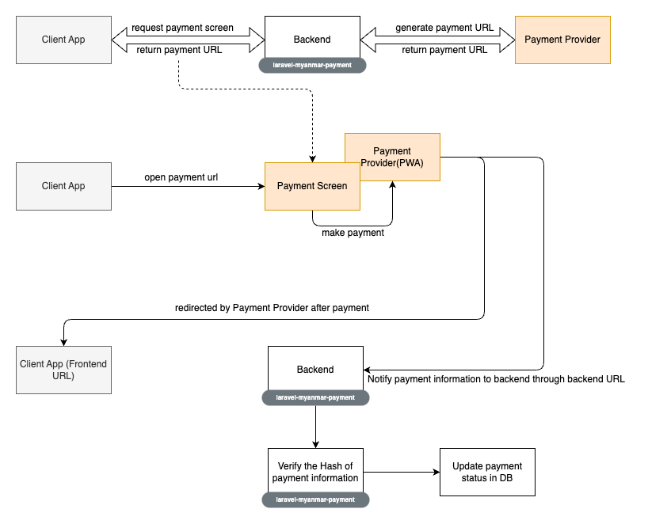
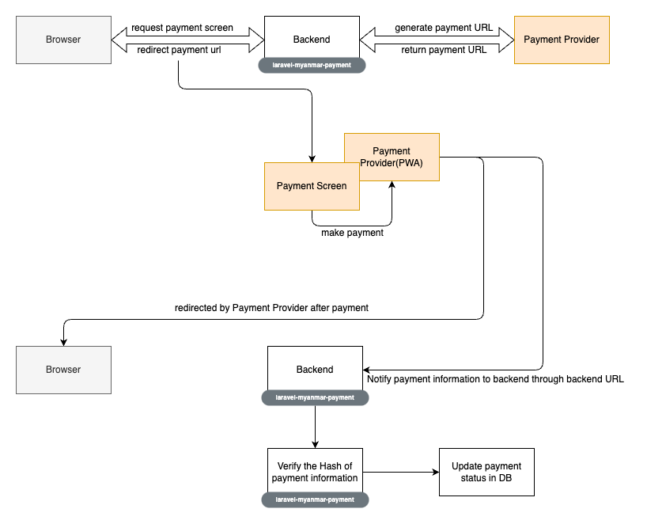

# Laravel Myanmar Payments

[](https://packagist.org/packages/Laranex/laravel-myanmar-payments)
[](https://packagist.org/packages/Laranex/laravel-myanmar-payments)

A Laravel Package to deal with Payment Providers from Myanmar. This package can take care of PGW payments.

Supported Payments are as follows.

- Wave Money
- 2C2P

### Workflows
- Client App - Server Workflow
<br>


- Server Side only Workflow
<br>


## Installation

You can install the package via composer:

```bash
composer require laranex/laravel-myanmar-payments
```

## Configuration

```bash
  php artisan vendor:publish --tag="laravel-myanmar-payments"
```

[Wave Money Configuration](https://github.com/DigitalMoneyMyanmar/wppg-documentation#23-environment)
[2c2P Configuration](https://developer.2c2p.com/docs/redirect-api-integrate-with-payment)

## Usage

```php
use Laranex\LaravelMyanmarPayments\LaravelMyanmarPaymentsFacade;


#Wave Money Payment Screen
LaravelMyanmarPaymentsFacade::channel('wave_money')
        ->getPaymentScreenUrl($items, $orderId, $amount, $merchantReferenceId, $backendResultUrl, $frontendResultUrl, $paymentDescription);
#Wave Money Validate Response Signature
Laranex\LaravelMyanmarPayments\LaravelMyanmarPaymentsFacade::channel("wave_money")
    ->verifyWaveSignature($request);   
   
      
#2c2p Payment Screen
LaravelMyanmarPaymentsFacade::channel('2c2p')
        ->getPaymentScreenUrl($orderId, $amount, $noneStr, $backendResultUrl,$currencyCode, $frontendResultUrl, $paymentDescription, $userDefined)
#2c2p Parse Response Payload to BackendUrl
Laranex\LaravelMyanmarPayments\LaravelMyanmarPaymentsFacade::channel('2c2p')
->parseJWT('jwtTokenFrom2c2cServer', $currencyCode);

#$frontendResultUrl & $paymentDescription are optional and the rest are mandatory.
```

For more api options, you can read the composition of the
- Wave Money function [here](src/WaveMoney.php)
- 2c2P [here](src/TwoCTwoP.php)

### Changelog

Please see [CHANGELOG](CHANGELOG.md) for more information what has changed recently.

## Contributing

Please see [CONTRIBUTING](CONTRIBUTING.md) for details.

### Security

If you discover any security related issues, please email naythukhant644@gmail.com instead of using the issue tracker.

## Credits

- [Nay Thu Khant](https://github.com/naythukhant)
- [Thin Aung](https://github.com/makgsoewar)


## License

The MIT License (MIT). Please see [License File](LICENSE.md) for more information.


## Stargazers over time
[](https://starchart.cc/laranex/laravel-myanmar-payments)

