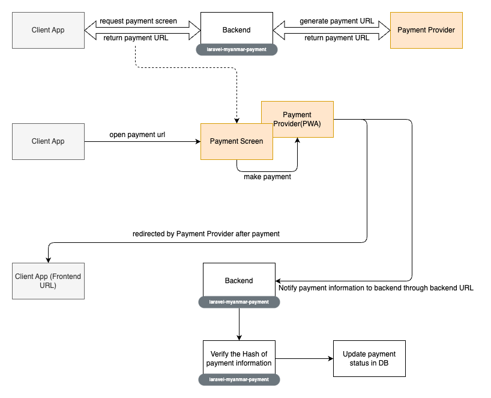
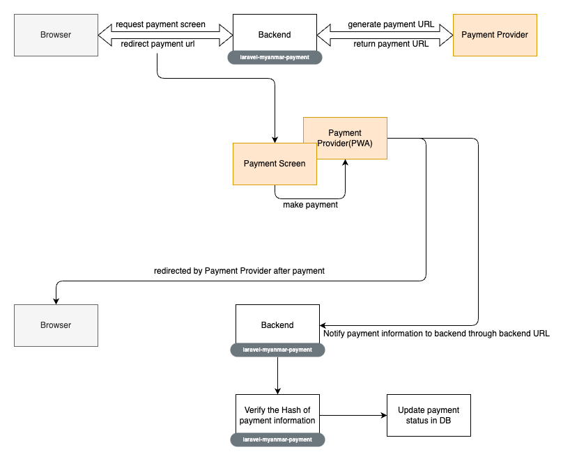

# Laravel Myanmar Payments

[](https://packagist.org/packages/Laranex/laravel-myanmar-payments)
[](https://packagist.org/packages/Laranex/laravel-myanmar-payments)

A Laravel Package to deal with Payment Providers from Myanmar. This package can take care of PGW payments.

Supported Payments are as follows.

- Wave Money
- KBZPay
- Cybersource
- AYA Payment Gateway
- Yoma MMQR

### Workflows
- Client App - Server Workflow
<br>


- Server Side only Workflow
<br>


## Installation

You can install the package via composer:

```bash
composer require laranex/laravel-myanmar-payments
```

## Configuration

```bash
  php artisan vendor:publish --tag="laravel-myanmar-payments"
```

## Upgrade Guide

- v1 -> v2
    - Backup & Delete the existing config/laravel-myanmar-payments.php (if only published before)
    - Publish the new config/laravel-myanmar-payments, and re-merge the old config/laravel-myanmar-payments.php
    - Update .env (KBZ Pay is supported now)

[Wave Money Configuration](https://github.com/DigitalMoneyMyanmar/wppg-documentation#23-environment)
[KBZ Pay Configuration](https://wap.kbzpay.com/pgw/uat/api/#/en/dashboard)

## Usage

```php
use Laranex\LaravelMyanmarPayments\LaravelMyanmarPaymentsFacade;


# WAVEMONEY
# Payment Screen
LaravelMyanmarPaymentsFacade::channel('wave_money')
    ->getPaymentScreenUrl($items, $orderId, $amount, $merchantReferenceId, $backendResultUrl, $frontendResultUrl, $paymentDescription)
# Validate Response Signature
Laranex\LaravelMyanmarPayments\LaravelMyanmarPaymentsFacade::channel("wave_money")
    ->verifyWaveSignature($request)

#KBZ PAY
# PWA URL
LaravelMyanmarPaymentsFacade::channel("kbz_pay.pwaapp")
    ->getPaymentScreenUrl($orderId, $amount, $nonceStr,  $backendResultUrl)
# QR Code
LaravelMyanmarPaymentsFacade::channel("kbz_pay.qr")
    ->getPaymentQr($orderId, $amount, $nonceStr,  $backendResultUrl)

# In App
LaravelMyanmarPaymentsFacade::channel("kbz_pay.app")->getPaymentData($orderId, $amount, $nonceStr, $backendResultUrl);

# $nonceStr should be at least 32 characters long, uppercase & numbers according to KbzPay Documentation

# Validate Response Signature
LaravelMyanmarPaymentsFacade::channel("kbz_pay.qr")
    verifySignature($request)

#Cybersource
# Secure Acceptance
LaravelMyanmarPaymentsFacade::channel("cyber_source.secure_acceptance")
    ->getPaymentData($transactionId, $referenceNumber, $amount)
    
# Validate Request Signature
LaravelMyanmarPaymentsFacade::channel("cyber_source.secure_acceptance")
    ->verifySignature($request)


# AYA Payment Gateway
# Request available payment methods
LaravelMyanmarPaymentsFacade::channel("aya_pgw")
    ->getPaymentServices()
# Payment Screen Payload
LaravelMyanmarPaymentsFacade::channel("aya_pgw")
    ->paymentRequest($orderId, $amount, $channel, $method, $currencyCode)
# Enquiry Payment Status
LaravelMyanmarPaymentsFacade::channel("aya_pgw")
    ->paymentEnquiry($orderId)
# Validate Response Payload Signature
LaravelMyanmarPaymentsFacade::channel("aya_pgw")
    ->verifySignature($payload, $checkSum)


# Yoma MMQR
# Checkout an order & generate its QR in one call
LaravelMyanmarPaymentsFacade::channel("yoma_mmqr")
    ->getPaymentQr($orderNumber, $amount, $description)
# Or run the two steps separately
LaravelMyanmarPaymentsFacade::channel("yoma_mmqr")
    ->checkoutOrder($orderNumber, $amount, $description)
LaravelMyanmarPaymentsFacade::channel("yoma_mmqr")
    ->generateQr($orderNumber)
# Enquiry Payment Status with the refLabel returned by the QR
LaravelMyanmarPaymentsFacade::channel("yoma_mmqr")
    ->checkPaymentStatus($refLabel)
# Validate Callback Signature
LaravelMyanmarPaymentsFacade::channel("yoma_mmqr")
    ->verifySignature($request)

# $orderNumber is limited to 20 characters and $description to 50 characters. The QR comes
# back as a base64 PNG that is only payable for 120 seconds, see the Yoma MMQR section below.
```


For more api options, you can read the composition of the
- Wave Money function [here](src/WaveMoney.php)
- KBZ Pay
  - [PWA](src/KbzPayPwa.php)
  - [QR](src/KbzPayQr.php)
  - [InApp](src/KbzPayApp.php)
- Cybersource 
  - [Secure Acceptance](src/CyberSourceSecureAcceptance.php)
- AYA Payment Gateway [here](src/AyaPgw.php)
- Yoma MMQR [here](src/YomaMmqr.php)

## Yoma MMQR

Yoma issues a MyanmarPay QR per order. It is the only gateway in this package that
authenticates with an access token instead of signing each request on its own, and that token
is deliberately not cached, so a fresh one is requested per call and nothing here holds state
between requests. Cache it in your application if the extra round trip ever matters.

### Environment

```dotenv
YOMA_MMQR_BASE_URL=https://devapi.yomabank.net
YOMA_MMQR_API_VERSION=v1rc
YOMA_MMQR_MERCHANT_ID=
YOMA_MMQR_CLIENT_ID=
YOMA_MMQR_CLIENT_SECRET=
YOMA_MMQR_WEBHOOK_SECRET=
```

The merchant id and the client id & secret all come from Yoma. The base url and api version
above are the UAT pair, swap both for the production pair Yoma hands over. The webhook secret
is the one you shared with Yoma for callbacks, see below, and can be left unset.

### Paying an order

An order is checked out once, then a QR is generated against it. `getPaymentQr()` does both.

```php
$qr = LaravelMyanmarPaymentsFacade::channel("yoma_mmqr")
    ->getPaymentQr($orderNumber, $amount, $description);

# ["refLabel" => "100000083331", "qrString" => "iVBORw0KGgo...", "expiresInSeconds" => 120]
```

`$orderNumber` is limited to 20 characters, `$description` to 50, and `$amount` must be numeric
and greater than 0. Anything else throws before a request is sent.

Yoma rejects a second checkout of an order number it already knows, so renewing a lapsed QR
means calling `generateQr()` on its own rather than `getPaymentQr()` again. Run the two steps
separately when an order outlives its first QR.

```php
LaravelMyanmarPaymentsFacade::channel("yoma_mmqr")
    ->checkoutOrder($orderNumber, $amount, $description)   # once per order
LaravelMyanmarPaymentsFacade::channel("yoma_mmqr")
    ->generateQr($orderNumber)                             # once per QR
```

### Displaying the QR

`qrString` is an already rendered PNG in base64, a full MyanmarPay slip showing the merchant
and the amount, so display it as is and skip the QR encoding library. This differs from
`kbz_pay.qr`, which returns a QR payload string you render yourself.

```blade

```

A QR stays payable for 120 seconds. Yoma reports no deadline of its own, so `expiresInSeconds`
is added by this package and counts from the moment the response lands, which makes it stale
as soon as it is stored. Turn it into a deadline on arrival instead.

```js
const expiresAt = Date.now() + data.expiresInSeconds * 1000
```

### Payment status

Every `generateQr()` mints a new `refLabel` and retires the one before it, so only the newest
label of an order answers.

```php
LaravelMyanmarPaymentsFacade::channel("yoma_mmqr")
    ->checkPaymentStatus($refLabel)

# ["refLabel" => "100000083331", "paymentStatus" => "PENDING"]   # SUCCESS once paid
```

Yoma answers business failures with a 200 status and an `errorCode` in the body, so this
package inspects the body and throws rather than handing back a misleading payload. A label
that can no longer be paid therefore raises an `Exception` instead of returning a status:
`QR EXPIRED` ("Qr has been expired.") for a lapsed QR, `MMQR FAILURE` ("Mmqr responds empty
response.") for one that has been retired by a newer QR. Poll with the newest label and treat
a throw as a cue to generate the next QR.

### Callback

Yoma posts `orderNumber`, `status` and `hashValue` to the callback url registered with them.

```php
Route::post("/payments/yoma-mmqr/callback", function (Request $request) {
    abort_unless(
        LaravelMyanmarPaymentsFacade::channel("yoma_mmqr")->verifySignature($request),
        401
    );

    # $request->get("orderNumber"), $request->get("status")
})->withoutMiddleware(VerifyCsrfToken::class);
```

The hash covers the payload `orderNumber=xxxx&status=xxxx` signed with the order number
prefixed to the client secret.

Set `YOMA_MMQR_WEBHOOK_SECRET` to the secret you shared with Yoma and the `X-Webhook-Secret`
header of the callback is asserted against it as well, before the hash is even computed. Leave
it unset and the header is not checked, which is what merchants who never shared a secret with
Yoma want, since none is sent to them.

> **Unverified:** the MMQR specification names neither the hash algorithm nor the `hashkey` it
> signs with, and Yoma only issues a client id and a client secret. `verifySignature()`
> therefore assumes HMAC-SHA256 with the client secret as that `hashkey`. Confirm it against a
> real callback before relying on it, a wrong guess fails every callback silently.

### Changelog

Please see [CHANGELOG](CHANGELOG.md) for more information what has changed recently.

## Contributing

Please see [CONTRIBUTING](CONTRIBUTING.md) for details.

### Security

If you discover any security related issues, please email naythukhant644@gmail.com instead of using the issue tracker.

## Contributors

- [Nay Thu Khant](https://github.com/naythukhant)
- [Thin Aung](https://github.com/makgsoewar)
- [Pai Soe Htike](https://github.com/paisoedev)


## License

The MIT License (MIT). Please see [License File](LICENSE.md) for more information.


